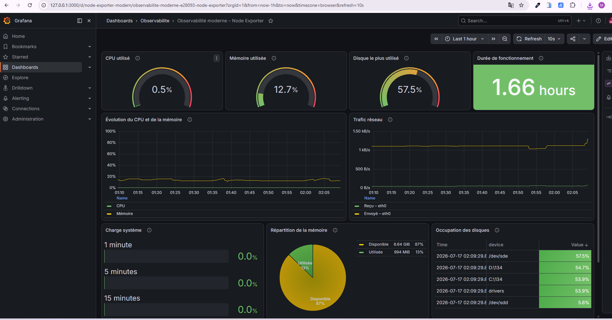
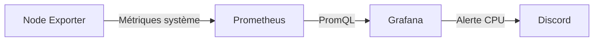

# Stack d’observabilité Prometheus et Grafana

Déploiement local d’une pile d’observabilité conteneurisée avec **Node Exporter**, **Prometheus** et **Grafana**.

Node Exporter collecte les métriques système de l’environnement Linux exécuté par Docker Desktop/WSL2. Prometheus les récupère et les stocke, puis Grafana les présente dans un dashboard provisionné automatiquement. Une alerte peut envoyer une notification Discord lorsque l’utilisation du processeur dépasse 80 % pendant deux minutes.

## Apercu Dashboard Grafana



## Problématique

Sans dispositif d’observabilité, l’état d’une infrastructure reste difficile à évaluer. Une saturation du processeur, un manque de mémoire, un disque presque plein ou une hausse inhabituelle du trafic réseau peuvent alors être détectés tardivement, souvent après une dégradation du service. L’absence de données historiques complique également l’analyse des incidents et l’identification de leur cause.

## Solution apportée

Ce projet met en place une chaîne de supervision automatisée et reproductible :

- **Node Exporter** collecte les métriques système à la source ;
- **Prometheus** centralise et historise ces données toutes les 15 secondes ;
- **Grafana** les transforme en indicateurs lisibles dans un dashboard en temps réel ;
- **Grafana Alerting** notifie l’équipe sur Discord lorsqu’un seuil critique est dépassé.

Cette solution permet de détecter plus rapidement les anomalies, de suivre l’évolution des ressources et de disposer de données exploitables pour diagnostiquer un incident. Son déploiement avec Docker Compose garantit une installation cohérente et facilement reproductible.

## Architecture



| Composant | Fonction | Port |
|---|---|---:|
| Node Exporter | Collecte CPU, mémoire, disques et réseau | `9100` |
| Prometheus | Collecte et conserve les séries temporelles | `9090` |
| Grafana | Visualise les métriques et évalue les alertes | `3000` |

## Prérequis

- Docker Desktop avec le moteur WSL2 ;
- Docker Compose v2 ou supérieur.

## Déploiement

Créez la configuration locale à partir du modèle :

```powershell
Copy-Item .env.example .env
```

Renseignez dans `.env` le compte administrateur Grafana et, si nécessaire, l’URL du webhook Discord. Lancez ensuite les services :

```powershell
docker compose config
docker compose up -d
docker compose ps
```

Les interfaces sont disponibles aux adresses suivantes :

| Service | URL |
|---|---|
| Grafana | <http://localhost:3000> |
| Prometheus | <http://localhost:9090> |
| Cibles Prometheus | <http://localhost:9090/targets> |
| Métriques Node Exporter | <http://localhost:9100/metrics> |

Le datasource Prometheus, le dashboard et la règle d’alerte sont chargés automatiquement au démarrage.

## Dashboard

Le dashboard fournit une vue en temps réel des indicateurs suivants :

- utilisation du processeur ;
- mémoire disponible et utilisée ;
- occupation des systèmes de fichiers ;
- disponibilité du système ;
- trafic réseau entrant et sortant.

Sa définition exportable est disponible dans [`grafana/dashboards/node-exporter-dashboard.json`](grafana/dashboards/node-exporter-dashboard.json).

## Alerting

La règle Grafana surveille l’utilisation moyenne du processeur avec la requête PromQL suivante :

```promql
100 * (1 - avg(rate(node_cpu_seconds_total{mode="idle"}[5m])))
```

L’alerte est déclenchée lorsque la valeur reste supérieure à **80 % pendant deux minutes**. Le webhook Discord est injecté depuis la variable `DISCORD_WEBHOOK_URL` du fichier `.env`.

Après modification du webhook, recréez le conteneur Grafana :

```powershell
docker compose up -d --force-recreate grafana
```

## Fichiers principaux

| Fichier | Rôle |
|---|---|
| `docker-compose.yml` | Démarre les trois conteneurs et monte leur configuration. |
| `prometheus/prometheus.yml` | Indique à Prometheus où récupérer les métriques. |
| `grafana/provisioning/datasources/datasource.yml` | Connecte automatiquement Grafana à Prometheus. |
| `grafana/provisioning/dashboards/dashboards.yml` | Demande à Grafana de charger le dashboard JSON. |
| `grafana/dashboards/node-exporter-dashboard.json` | Définit les panneaux et leurs requêtes PromQL. |
| `grafana/provisioning/alerting/cpu-alert.yml` | Définit le seuil CPU et la notification Discord. |
| `.env.example` | Présente les variables à renseigner sans exposer les secrets. |

## Arrêt des services

```powershell
docker compose down
```

Les volumes Docker conservent les données de Prometheus et Grafana entre deux démarrages.

## Licence

Ce projet est sous licence **MIT** — voir le fichier [LICENSE](LICENSE) pour plus de détails.