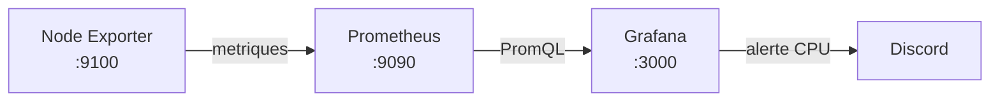

# Pile d'observabilite moderne

Ce projet deploie une pile locale composee de **Node Exporter**, **Prometheus** et **Grafana**. Node Exporter expose les metriques systeme, Prometheus les collecte toutes les 15 secondes et Grafana affiche un dashboard provisionne automatiquement. Une alerte Grafana se declenche lorsque le CPU depasse 80 % pendant deux minutes.

## Architecture



## Prerequis

- Docker Desktop demarre avec le moteur WSL2 et les conteneurs Linux
- Docker Compose v2 ou plus recent
- Git, uniquement pour publier le projet

Verification :

```powershell
docker --version
docker compose version
```

## Demarrage rapide

1. Creez votre configuration locale :

   ```powershell
   Copy-Item .env.example .env
   ```

2. Modifiez `.env` et choisissez un mot de passe Grafana. Si vous avez un webhook Discord, remplacez aussi l'URL factice. Le fichier `.env` est ignore par Git.

3. Validez et lancez la pile :

   ```powershell
   docker compose config
   docker compose up -d
   docker compose ps
   ```

4. Ouvrez les interfaces :

   | Service | Adresse | Verification |
   |---|---|---|
   | Node Exporter | <http://localhost:9100/metrics> | des metriques `node_*` sont visibles |
   | Prometheus | <http://localhost:9090> | la requete `up` retourne `1` |
   | Cibles Prometheus | <http://localhost:9090/targets> | les deux cibles sont `UP` |
   | Grafana | <http://localhost:3000> | connexion avec les valeurs de `.env` |

Le datasource Prometheus, le dashboard et l'alerte sont charges automatiquement. Le dashboard se trouve dans le dossier **Observabilite** de Grafana.

## Dashboard

Le fichier exportable [`grafana/dashboards/node-exporter-dashboard.json`](grafana/dashboards/node-exporter-dashboard.json) contient huit visualisations :

- utilisation CPU actuelle et historique ;
- utilisation de la memoire actuelle et historique ;
- utilisation des systemes de fichiers ;
- duree de disponibilite ;
- trafic reseau entrant et sortant.

Les seuils graphiques passent en orange puis en rouge lorsque les valeurs deviennent critiques. Le dashboard se rafraichit toutes les 10 secondes.

Les dashboards provisionnes peuvent etre modifies dans l'interface, mais Grafana ne reecrit pas automatiquement le fichier JSON monte en lecture seule. Apres une personnalisation, exportez le dashboard depuis **Dashboard settings > JSON model/Export** et remplacez le JSON du depot.

## Alerte CPU et Discord

La regle provisionnee dans `grafana/provisioning/alerting/cpu-alert.yml` utilise cette requete :

```promql
100 * (1 - avg(rate(node_cpu_seconds_total{mode="idle"}[5m])))
```

Elle est evaluee chaque minute et passe en alerte lorsque la valeur reste superieure a 80 % pendant deux minutes. Le point de contact Discord utilise la variable `DISCORD_WEBHOOK_URL` transmise depuis `.env`.

Pour creer le webhook dans Discord :

1. ouvrez les parametres du serveur puis **Integrations > Webhooks** ;
2. creez un webhook et copiez son URL ;
3. placez l'URL dans `.env` sans la publier ;
4. recreez Grafana pour charger la nouvelle valeur :

   ```powershell
   docker compose up -d --force-recreate grafana
   ```

5. dans Grafana, ouvrez **Alerting > Contact points > Discord**, puis lancez un test.

Pour tester la regle sans charger fortement la machine, remplacez temporairement le seuil `80` par `1` dans `cpu-alert.yml`, recreez Grafana, attendez quelques minutes, puis remettez `80`.

> L'URL d'un webhook est un secret. Ne commitez jamais `.env`, une capture affichant cette URL ou un export Grafana qui la contient.

## Commandes utiles

Afficher l'etat et les journaux :

```powershell
docker compose ps
docker compose logs --tail 100 prometheus
docker compose logs --tail 100 node-exporter
docker compose logs --tail 100 grafana
```

Arreter sans perdre les donnees :

```powershell
docker compose down
```

Arreter et supprimer les donnees locales :

```powershell
docker compose down -v
```

Recharger `prometheus.yml` apres une modification :

```powershell
Invoke-WebRequest -Method Post http://localhost:9090/-/reload
```

## Structure du depot

```text
.
|-- docker-compose.yml
|-- prometheus/
|   `-- prometheus.yml
|-- grafana/
|   |-- dashboards/
|   |   `-- node-exporter-dashboard.json
|   `-- provisioning/
|       |-- alerting/cpu-alert.yml
|       |-- dashboards/dashboards.yml
|       `-- datasources/prometheus.yml
|-- .env.example
|-- .gitignore
`-- README.md
```

## Particularite de Windows

Node Exporter est un outil Linux. Avec Docker Desktop sous Windows, les montages `/proc`, `/sys` et `/` exposent l'environnement Linux de Docker/WSL2. Le dashboard mesure donc cette machine virtuelle Linux, et non tous les compteurs natifs de Windows.

Pour superviser reellement l'hote Windows, il faudrait installer **Windows Exporter** sur Windows puis ajouter `host.docker.internal:9182` aux cibles Prometheus. Ce serait une variante du projet demande, qui exige explicitement Node Exporter.

## Publication GitHub

Avant de publier, verifiez qu'aucun secret n'est suivi :

```powershell
git status
git check-ignore .env
```

Les livrables principaux sont `docker-compose.yml`, `prometheus/prometheus.yml` et le JSON du dashboard. Les fichiers de provisioning rendent en plus le projet completement reproductible.
